# DroneView — UTM Research Analytics Dashboard

A simulation analytics dashboard built at **IIT Bombay** for Unmanned Traffic Management (UTM) research.
Connect it to your simulation data (Excel workbook or PostgreSQL) and explore drone flight outcomes,
collision patterns, safety metrics, fleet performance, and machine-learning risk scores across
7 analysis pages.

---

## Landing Page


The animated hero screen features a live Canvas drone particle system. Click **Connect Data Source** to load your simulation data.

---

## Login / Connect

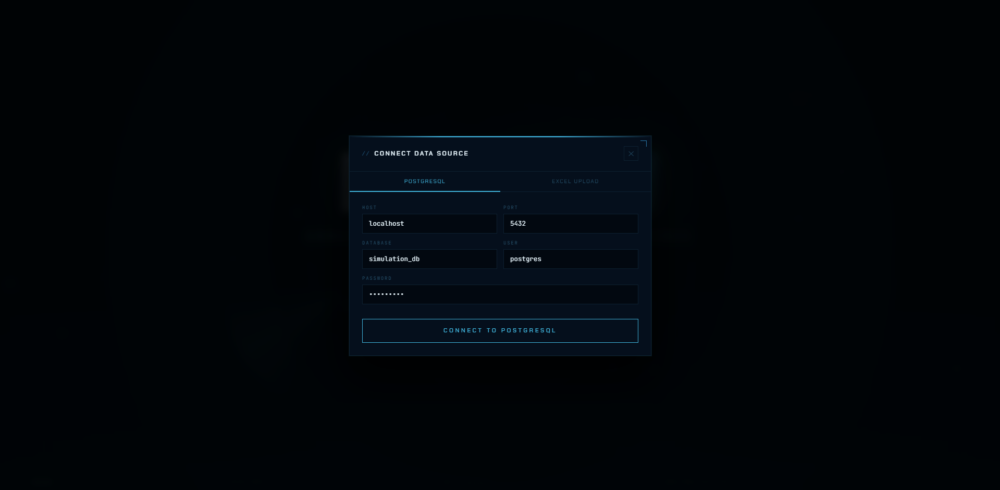

Choose between a **PostgreSQL** connection or an **Excel Upload** to bring in your simulation workbook.

---

## Pages

| Page | Question it answers |
|---|---|
| **Overview** | What happened in this trial? |
| **Airspace & Spatial** | Where did things happen? |
| **Safety Analysis** | How safe is the system? |
| **Fleet & Efficiency** | How well did the fleet perform? |
| **Temporal Dynamics** | When did things happen? |
| **Predictive Risk** | Which drones were most likely to crash and why? |
| **Trial Intelligence** | Deep dive — event intensity, severity progression, outcome funnel |

---

### Overview

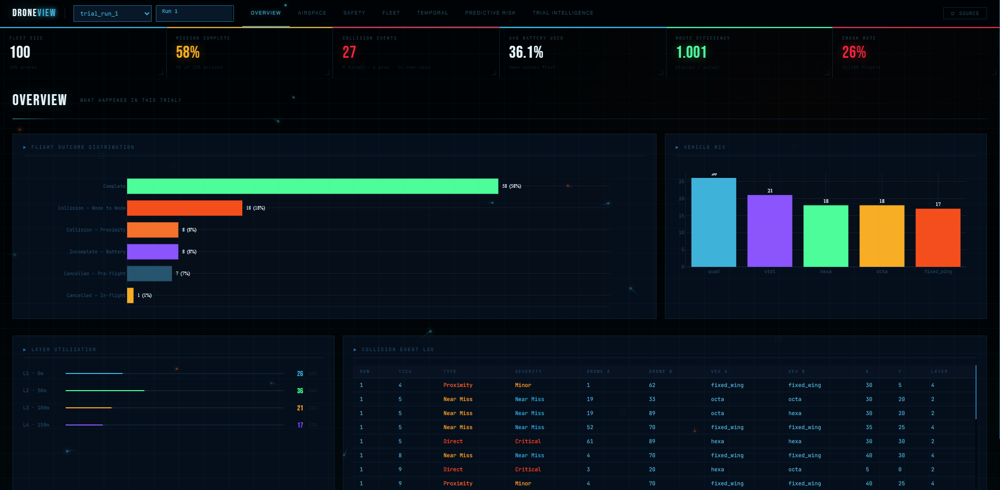

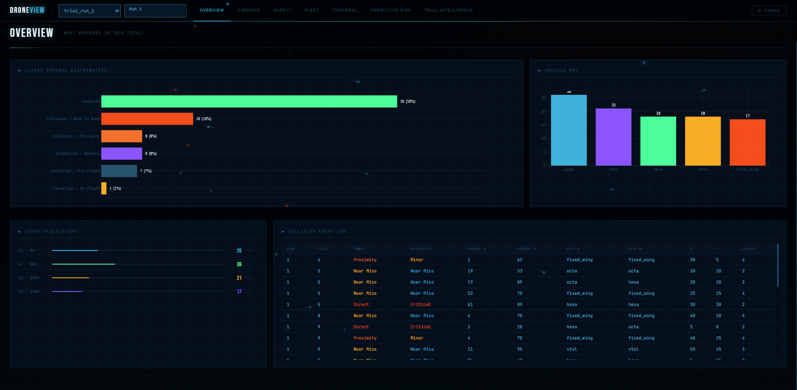

High-level trial summary: total drones, completion rate, collision counts, and battery statistics at a glance.

---

### Airspace & Spatial

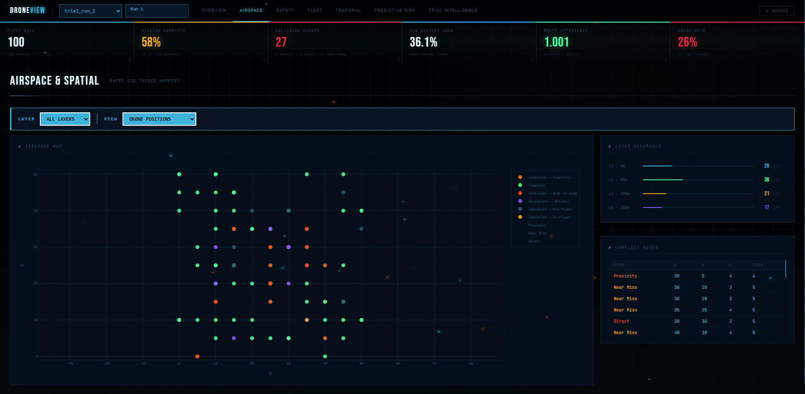

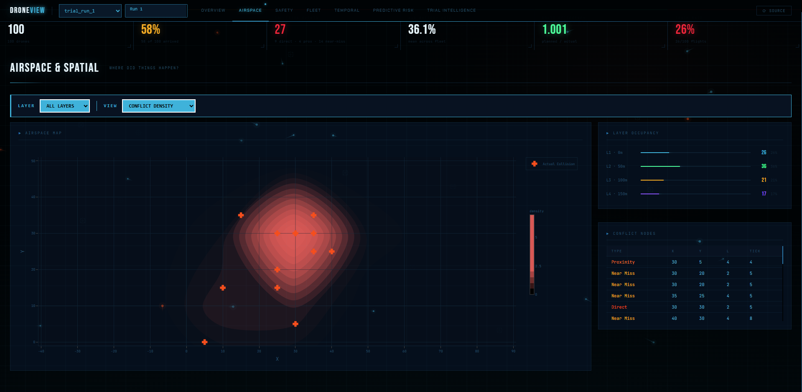

Geo-spatial breakdown of where collisions and proximity events cluster across the IIT Bombay Powai corridor graph.

---

### Safety Analysis

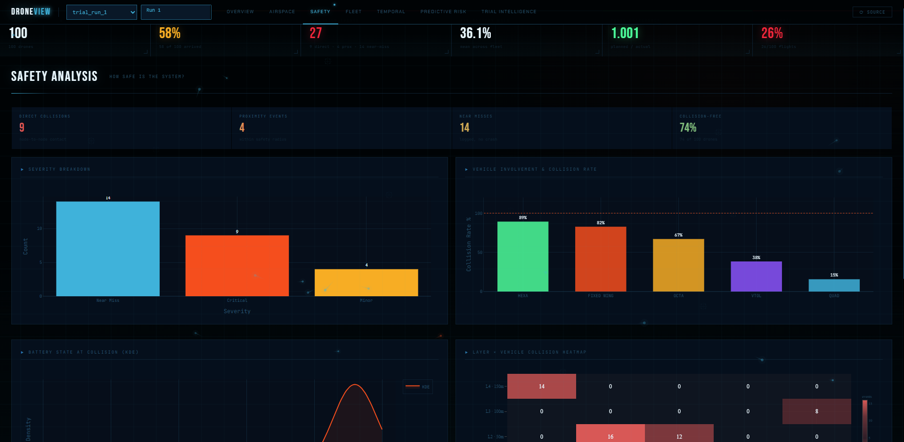

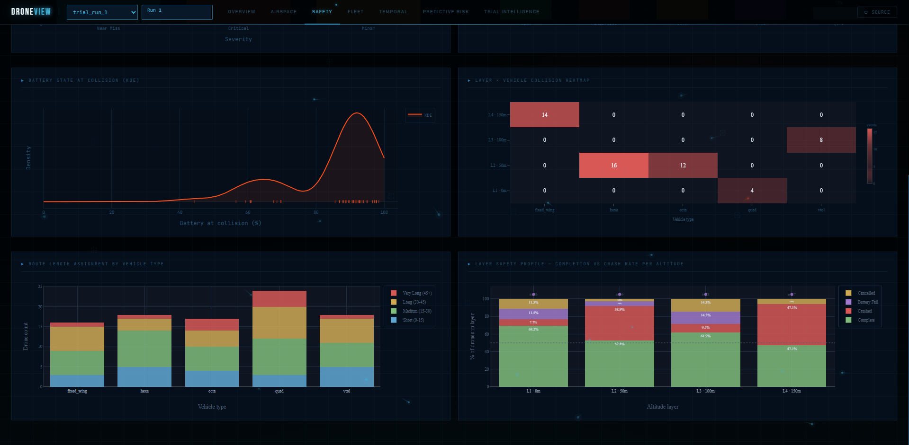

Per-layer collision rates, proximity heat curves, and severity progression across simulation runs.

---

### Fleet & Efficiency

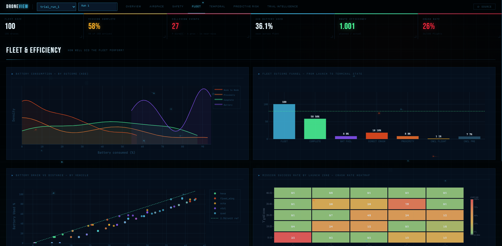

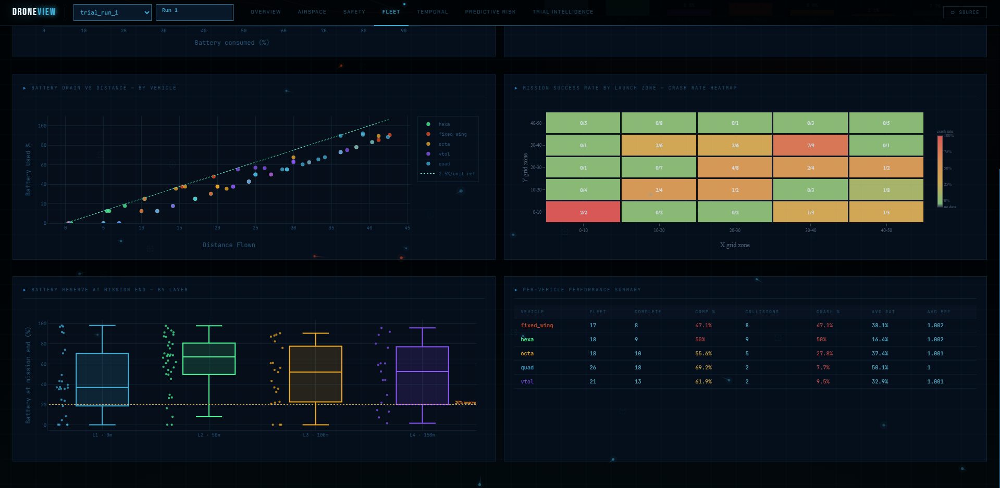

Fleet-level KPIs: route efficiency, battery consumption distributions (KDE), and vehicle-type breakdowns.

---

### Temporal Dynamics

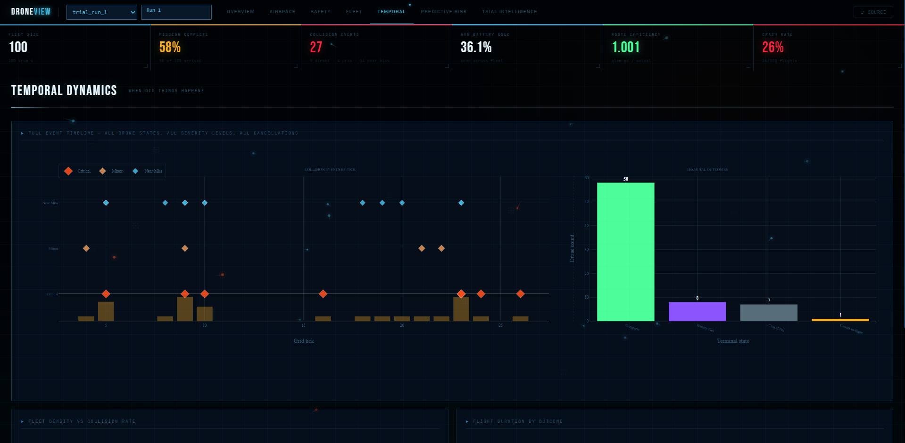

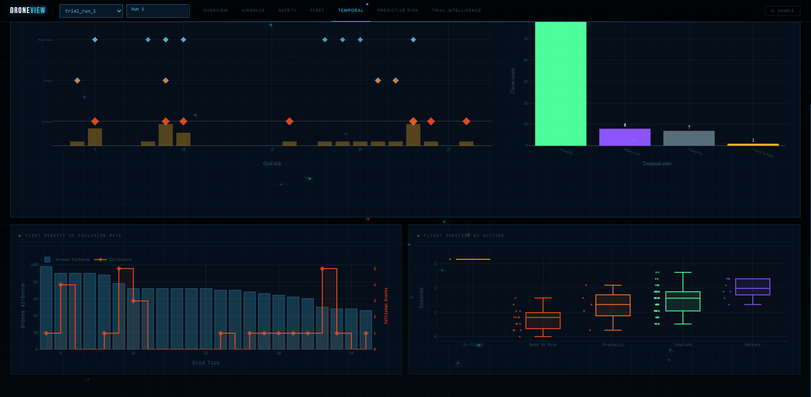

Time-series view of when events occur — collision spikes, peak traffic windows, and drone arrival patterns.

---

### Predictive Risk

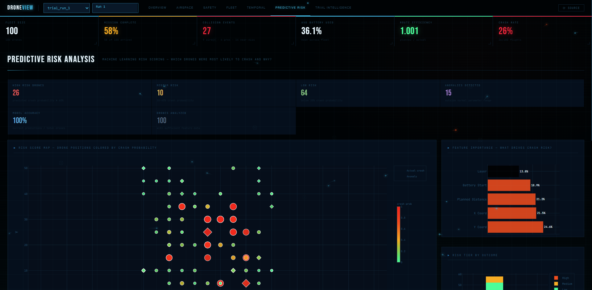

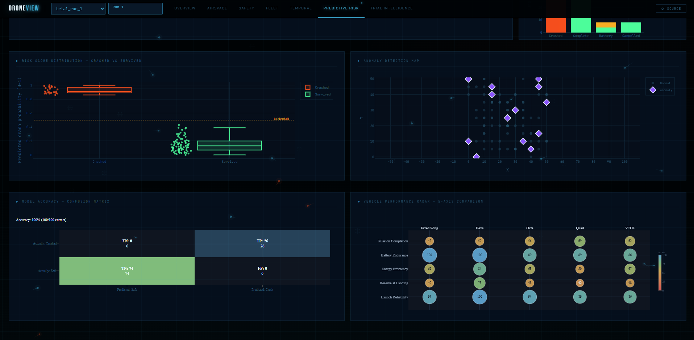

Machine-learning risk scores from a Random Forest model + Isolation Forest anomaly detection, surfacing which drones were most likely to collide and why.

---

### Trial Intelligence

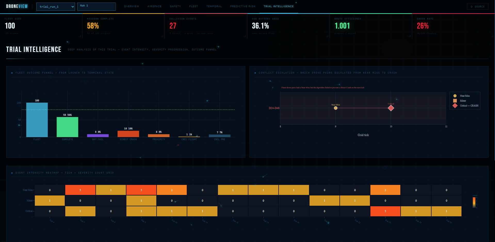

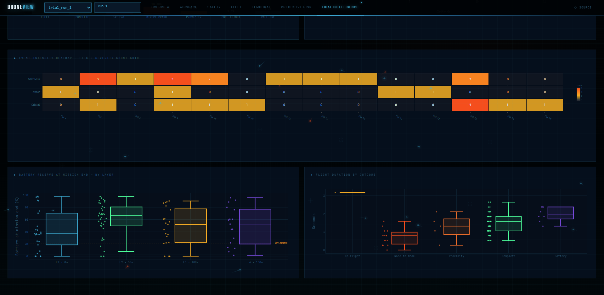

Deep-dive analytics: event intensity over time, outcome funnel (completed → proximity → collision → cancelled), and severity progression across the trial.

---

## Tech Stack

### Backend

| | Version | What it does in this project |
|---|---|---|
| **Python** | 3.10+ | Core language |
| **FastAPI** | ≥ 0.111 | REST API + serves the frontend static files |
| **Uvicorn** | ≥ 0.29 | ASGI server |
| **Pandas** | ≥ 2.0 | DataFrame filtering, groupby, aggregation on simulation data |
| **NumPy** | ≥ 1.24 | Numerical ops, NaN/Inf handling for the JSON serialiser |
| **SciPy** | ≥ 1.11 | Gaussian KDE curves for battery and efficiency charts |
| **scikit-learn** | ≥ 1.3 | Random Forest crash-risk scoring + Isolation Forest anomaly detection (Predictive Risk page) |
| **openpyxl** | ≥ 3.1 | Reads the Excel simulation workbook |
| **SQLAlchemy + psycopg2** | ≥ 2.0 | PostgreSQL connection |

### Frontend

| | Version | What it does in this project |
|---|---|---|
| **Vanilla HTML / CSS / JS** | ES6+ | No framework, no build step |
| **Plotly.js** | 2.27.1 | All charts — bar, scatter, KDE, heatmap, bubble, radar, timeline |
| **GSAP + ScrollTrigger** | 3.12.2 | Card reveal scroll animations on page load |
| **Canvas API** | Native | Animated drone particle system on the hero/landing screen |

### Fonts (Google Fonts)
**Bebas Neue** · **Chakra Petch** · **JetBrains Mono** · **Teko**

---

## Quick Start

### 1. Clone

```bash
git clone https://github.com/YOUR_USERNAME/droneview-utm.git
cd droneview-utm
```

### 2. Install dependencies

```bash
pip install -r requirements.txt
```

> `scikit-learn` is needed only for the **Predictive Risk** page.
> All other pages work without it — the backend returns a friendly error message if it's missing.

### 3. Run

```bash
python -m uvicorn main:app --reload --port 8000
```

### 4. Open

```
http://127.0.0.1:8000
```

Click **Connect Data Source** and choose:
- **PostgreSQL** — enter your host / port / database / user / password
- **Excel Upload** — drag and drop your `.xlsx` simulation workbook

---

## Project Structure

```
droneview-utm/
│
├── main.py                  Single-file FastAPI backend (~1 200 lines)
│                            All data loading, KPI computation, chart-data
│                            builders, and REST endpoints are in here.
│
├── requirements.txt
│
├── docs/
│   ├── DATA_FORMAT.md       Excel workbook format + PostgreSQL schema
│   └── HOW_TO_ADD_A_CHART.md  Step-by-step guide for future development
│
└── frontend/                Pure HTML / JS / CSS — no build step
    ├── index.html           Single page shell. All 7 page panels live here.
    ├── css/
    │   └── main.css         Full design system. Edit :root tokens to retheme.
    └── js/
        ├── api.js           All fetch() calls — one method per endpoint
        ├── app.js           STATE, modal, trial/path selection, page routing,
        │                    KPI animations, calls chart functions
        ├── charts.js        All Plotly chart functions, one per chart,
        │                    organised by page section
        └── animations.js    Background canvas drone particle animation
```

---

## Data Format

### Excel workbook

Your workbook needs two types of sheets:

**`Run 1`, `Run 2`, … `Run N`** — one sheet per simulation path run
- Row 1: title (e.g. `"Simulation Run 1"`)
- Row 2: column headers (see `docs/DATA_FORMAT.md` for the full list)
- Row 3+: data rows

**`Collision Log`** — all collision events across all runs
- Row 1: column headers
- Row 2+: data rows

### PostgreSQL

Tables `drone_summary_3d` and `collision_log_3d`, both joined with `simulation_runs` on `run_id`.
The `run_label` column in `simulation_runs` becomes the trial identifier in the dashboard.

Full schema: [`docs/DATA_FORMAT.md`](docs/DATA_FORMAT.md)

---

## How the backend works

All data is loaded once on connect and held in two Pandas DataFrames in memory (`_S` dict).
Every API call filters those DataFrames — no database round-trip after the initial load.
This means responses are instant, but restarting the server requires reconnecting.

```
Excel / PostgreSQL
      ↓
main.py  load_excel() / load_postgres()
      ↓
_S["drones"]      one row per drone flight
_S["collisions"]  one row per collision event
      ↓
_get(trial, path_runs)   filters to the requested subset
      ↓
Chart-data builders      one function per chart
      ↓
FastAPI route             wraps result in JSON
      ↓
Browser  api.js → app.js → charts.js → Plotly renders
```

---

## Authors

IIT Bombay UTM Research Group · 2026  
DGCA Compliance Research · DroneView Analytics Dashboard v1
